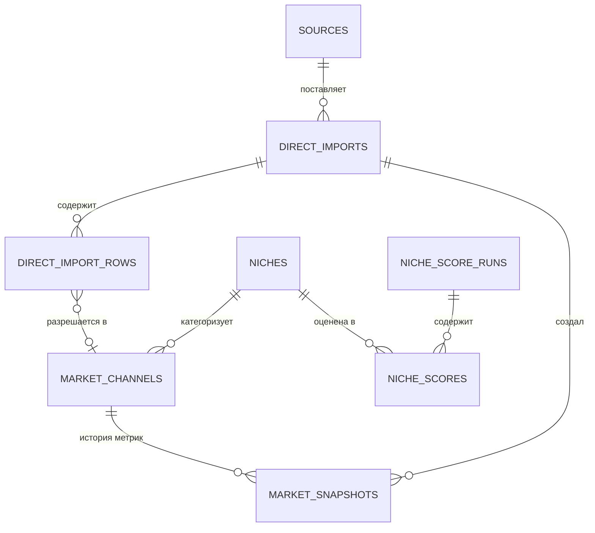

# Архитектура

## Принцип

Modular monolith: один Python-пакет, разбитый на слабо связанные доменные
модули. Никаких микросервисов, очередей, Redis, Celery и Kubernetes, пока не
появится реальная проблема, которую они решают.

Слои:

1. **Entry points** — CLI (Typer). FastAPI появится, когда понадобится
   dashboard; в PHASE 1 его нет намеренно.
2. **Domain services** — бизнес-логика (`DirectImportService` и далее).
3. **Repositories** — тонкая обёртка над SQLAlchemy, прячет детали запросов.
4. **Persistence** — PostgreSQL, единственный source of truth.

## Модули

| Модуль | Ответственность |
|---|---|
| `core` | Настройки (`.env`), логирование, доменные enum'ы |
| `db` | Модели, репозитории, async-движок и сессии |
| `direct` | Импорт выгрузок: `mapping` → `normalization` → `importer` |
| `market` | Агрегаты по нишам, считаются в PostgreSQL |
| `niches` | Конфигурация, Niche Score, оркестрация анализа, отчёты |
| `competitors` | Бенчмарки ниши, лидеры, watchlist, досье |
| `research` | Сбор фактов из источников, кластеризация, Topic Score |
| `content` | Черновик поста из research-кластера |
| `providers` | Внешние провайдеры (LLM) с учётом лимитов и расходов |
| `publishers` | Контракт публикации, транспорт MAX, kill switch |
| `cli` | Команды Typer |

Планируемые (пока не созданы): `analytics`, `monetization`.

### `publishers`

Слои те же, что и в остальном коде: транспорт (`max/client.py`) отдельно от
правил публикации (`max/adapter.py`), настройки не протекают в клиент
(`max/factory.py`), а решение «публиковать ли вообще» принимает `service.py`
с двумя выключателями (`PUBLISH_MODE`, `AUTO_PUBLISH_ENABLED`).

Единственная сетевая зависимость — `httpx`. Формат сообщений, лимиты и порядок
загрузки файлов взяты из <https://dev.max.ru/docs-api>, а не по памяти.

Хост API по умолчанию — `platform-api.max.ru`, а не названный в документации
`platform-api2.max.ru`: последний отдаёт сертификат Минцифры, которого нет ни в
`certifi`, ни в хранилище Windows. Подробности — в
[max-publishing.md](max-publishing.md).

## Sync vs async

БД-слой асинхронный (SQLAlchemy 2 + asyncpg) — один способ доступа к данным для
CLI сегодня и для FastAPI позже.

Чтение и разбор файлов — обычный синхронный код: это CPU/локальный I/O, где
async ничего не даёт. Он вызывается из асинхронного конвейера через
`asyncio.to_thread`, чтобы не блокировать цикл событий.

## Модель данных (PHASE 1–2)

| Таблица | Назначение |
|---|---|
| `sources` | Реестр источников данных (выгрузки, каталоги, позже — источники фактов) |
| `niches` | Таксономия категорий; создаётся на лету из категорий выгрузки |
| `direct_imports` | Один прогон импорта: файл, контрольная сумма, счётчики, статус |
| `direct_import_rows` | Строка файла в сыром и нормализованном виде + ошибки/предупреждения |
| `market_channels` | Идентичность канала на рынке (не наш канал) |
| `market_snapshots` | Метрики канала на дату — только добавление, без обновлений |
| `niche_score_runs` | Один запуск скоринга: датасет, веса, пороги, охват платформы |
| `niche_scores` | Оценка ниши в прогоне: score, ранг, разбивка по компонентам |
| `competitor_watchlist` | Намерение отслеживать канал как конкурента (без своих снимков) |

Решения по схеме:

* **UUID** как первичные ключи, генерируются в Python — это позволяет собрать
  родителя и детей в памяти и записать одним batch-insert'ом.
* **timestamptz**, время хранится в UTC.
* **JSONB** для `raw_data` / `normalized_data` / `extra` / `errors` / `warnings` —
  структура источника заранее неизвестна и обязана сохраняться целиком.
* Имена ограничений заданы `naming_convention`, чтобы autogenerate давал
  стабильные диффы, а ограничения можно было удалить по имени.

## Аналитика (PHASE 2)

Агрегаты считаются в PostgreSQL (`percentile_cont`, оконные функции), а не
собираются в Python: база умеет медианы и квантили нативно, и незачем возить
сырые строки в приложение ради их свёртки.

Niche Score v1 — взвешенное среднее компонентов, приведённых к 0–100
перцентильным рангом. Недоступные компоненты исключаются с перенормировкой
весов. Подробности и обоснование — в [niche-score.md](niche-score.md).

Отчёты рендерятся из сохранённого прогона, а не пересчитываются на лету: файл
отчёта обязан соответствовать тому, что лежит в базе, даже если после расчёта
импортировали новые данные.

## Анализ конкурентов (PHASE 3)

Конкурент — это обычный `market_channels`, его история уже в
`market_snapshots`, поэтому отдельных снимков для конкурентов нет: watchlist
добавляет только намерение и заметку. Позиции считаются внутри ниши **и
платформы**. Границы источника и методологические решения — в
[competitor-analysis.md](competitor-analysis.md).

## Отложено осознанно

Эти сущности спроектированы (см. discovery), но **не создаются заранее** —
каждая появится в своей фазе:
`channels` / `channel_accounts` (PHASE 4), `content_*` (PHASE 5),
`assets` (PHASE 6), `publications` и метрики (PHASE 8–11),
`experiments` (PHASE 12), `monetization_*` (PHASE 13),
`users` / `audit_events` (PHASE 5).
